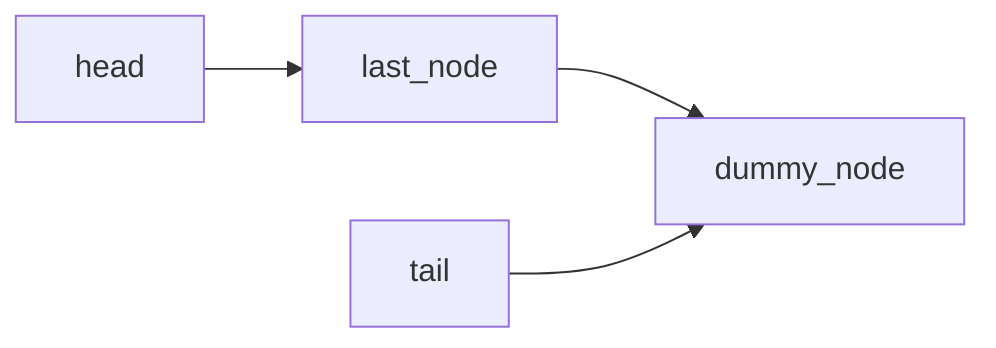
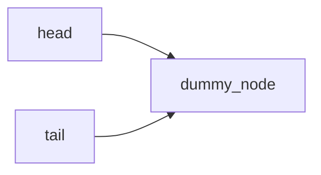

### 6.1


### 6.2


### 6.3


### 6.4


### 6.5


### 6.6

```c++
//错误的pop_head实现方式
std::unique_ptr<node> threadsafe_queue::pop_head()
    {
        node* const old_tail=get_tail();
        std::lock_guard<std::mutex> head_lock(head_mutex);
        if(head.get()==old_tail)
        {
            return nullptr;
        }
        std::unique_ptr<node> const old_head=std::move(head);
        head=std::move(old_head->next);
        return old_head;
    }
```
假设有A和B两个线程，A和B都会调用try_pop方法，A先于B调用
当A进入pop_head后，由于head_mutex的原因，那么B会卡在head_lock的地方不会在往下进行
A实际上会pop当前头部的元素，若在这个过程中有其他线程获取了tail的mutex并改动了tail，那么B拿到old_tail就不是原来的tail了
比如C线程此时调用push方法，就会修改tail

此时B再去调用head.get()==old_tail 就不会相等，从而进行后面的操作导致head指向了超出queue边界的地方


A和B线程调用pop_head的时候，queue的状态如上图


A线程执行完后，B准备执行comparison时的queue状态
一旦此时old_tail的值发生改变，那么comparison的不成立，后续操作会导致head指向dummy_node之后


### 6.12

对于一个look-up table，如何获取它的整体snapshot?

在这个过程中，可能会存在其他线程修改该table的bucket，因此要lock bucket_type的mutex，防止其他线程修改bucket_type

而且使用的lock是unique lock

```c++
std::vector<std::unique_lock<boost::shared_mutex> > locks;
for(unsigned i=0;i<buckets.size();++i)
{
        locks.push_back(
            std::unique_lock<boost::shared_mutex>(buckets[i].mutex));
}

std::map<Key,Value> res;
for(unsigned i=0;i<buckets.size();++i)
{
        for(bucket_iterator it=buckets[i].data.begin();
            it!=buckets[i].data.end();
            ++it)
        {
            res.insert(*it);//由于前面已经将bucket_type内的mutex lock
        }
}
```
