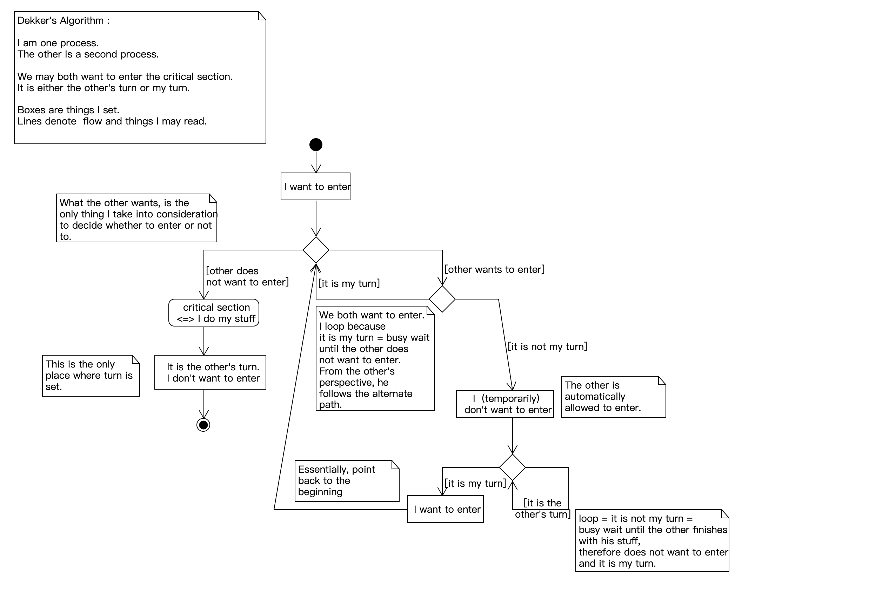

### Executor

#### 1. Features

plugagble, share-able, customizable


#### 2. scheduling mechanisms

```c++

run(Taskflow&f) --> run_n(f,1,[](){}) 

--> run_until(f,[repeat]()mutable{return repeat--=0},std::forward<C>(c))

```


**run_until**具体实现如下

```c++
_increment_topology();

//---

// create a topology for this run
auto tpg = std::make_shared<Topology>(
    f, std::forward<P>(pred), std::forward<C>(c)
);
  
// need to create future before the topology got torn down quickly
tf::Future<void> future(tpg->_promise.get_future(), tpg);

//---

_set_up_topology(tpg.get())


return future;

```


**schedule**具体实现如下

```c++
inline void Executor::_schedule(const std::vector<Node*>& nodes) {
  const auto num_nodes = nodes.size();  
  if(num_nodes == 0) {
    return;
  }
  // worker thread
  /*
   struct PerThread {
    Worker* worker;
    PerThread() : worker {nullptr} { }
  };
  */
  auto worker = _per_thread.worker;// static thread_local PerThread _per_thread;                                  
  if(worker != nullptr && worker->_executor == this) {
    for(size_t i=0; i<num_nodes; ++i) {
      worker->_wsq.push(nodes[i]);//_wsq,work stealing queue, TaskQueue<Node*>
    }
    return;
  } 
  // other threads
  {
    std::lock_guard<std::mutex> lock(_wsq_mutex);
    for(size_t k=0; k<num_nodes; ++k) {
      _wsq.push(nodes[k]);
    }
  }
  _notifier.notify_n(num_nodes);
}
```

#### Related algorithms

##### 1.Dekker's Algorithm



```c++
variables
        wants_to_enter : array of 2 booleans
        turn : integer

    wants_to_enter[0] ← false
    wants_to_enter[1] ← false
    turn ← 0   // or 1
```

```c++
    p0:
   wants_to_enter[0] ← true
   while wants_to_enter[1] {
      if turn ≠ 0 {
         wants_to_enter[0] ← false
         while turn ≠ 0 {
           // busy wait
         }
         wants_to_enter[0] ← true
      }
   }

   // critical section
   ...
   turn ← 1
   wants_to_enter[0] ← false
   // remainder section

```

```c++
p1:
   wants_to_enter[1] ← true
   while wants_to_enter[0] {
      if turn ≠ 1 {
         wants_to_enter[1] ← false
         while turn ≠ 1 {
           // busy wait
         }
         wants_to_enter[1] ← true
      }
   }
 
   // critical section
   ...
   turn ← 0
   wants_to_enter[1] ← false
   // remainder section
```
